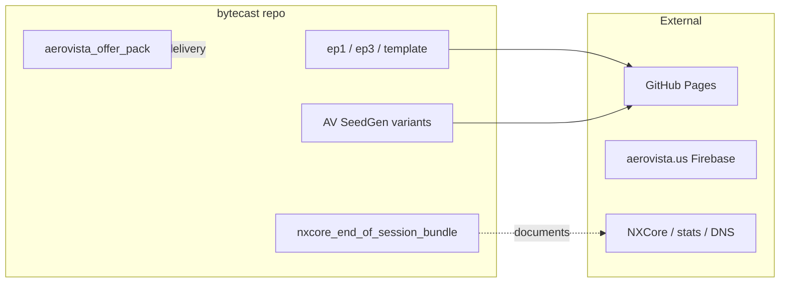

# How to Advance the Bytecast Project

## Current state (summary)

The repo holds **ByteCast episodes** (audio+slides+quest), **AeroVista offer pack** (sales/delivery), **AV SeedGen** (Python static bundle generator), and **handoff/ops docs**. Deployment targets are GitHub Pages (drops) and aerovista.us (Firebase). Work orders already call out per-drop subdomains (`vday.aerovista.us`, `<repo>.aerovista.us`) and stats.aerocoreos.com exposure.

---

## Axis 1: Repo foundation (hygiene and discoverability)

**Goal:** New contributors and future-you can orient quickly; no dead or duplicate code.

| Action                           | Detail                                                                                                                                                                                                                                                                                                                               |
| -------------------------------- | ------------------------------------------------------------------------------------------------------------------------------------------------------------------------------------------------------------------------------------------------------------------------------------------------------------------------------------ |
| Add root README                  | Single entry point: what bytecast is, map of [ep1](ep1/), [ep3](ep3/), [template](template/), [aerovista_offer_pack](aerovista_offer_pack/), [full_seed_starter](full_seed_starter/). Call out that episodes need a local server for JSON.                                                                                           |
| Remove or consolidate duplicates | [av_seedgen_python (2)](full_seed_starter/av_seedgen_python%20(2)/) and [av_seedgen_python_profiles (2)](full_seed_starter/av_seedgen_python_profiles%20(2)/) are almost certainly accidental copies. Pick canonical folders (e.g. `av_seedgen_python`, `av_seedgen_python_profiles`), delete the `(2)` clones unless you need them. |
| Fix episode naming               | [ep3/README.md](ep3/README.md) says "EP-002 (Fixed)" and "EP-2"; folder is `ep3`. Either rename folder to `ep2` or change README/titles to EP-003.                                                                                                                                                                                   |
| Unify episode run instructions   | [template/README.md](template/README.md) and [ep1/README.md](ep1/README.md) overlap. State once that "JSON-driven episodes require a local server (e.g. `python -m http.server 8080`); double-click may fail." and reference from both.                                                                                              |

**Effort:** Low. **Impact:** High for onboarding and maintenance.

---

## Axis 2: Delivery pipeline (from repo to live drop)

**Goal:** Repeatable path from "seed or episode in bytecast" to a live URL (e.g. `vday.aerovista.us` or `https://aerovista-us.github.io/<repo>/`).

| Action                            | Detail                                                                                                                                                                                                                                                                                                                                                                       |
| --------------------------------- | ---------------------------------------------------------------------------------------------------------------------------------------------------------------------------------------------------------------------------------------------------------------------------------------------------------------------------------------------------------------------------- |
| Document "drop" flow in this repo | Add a short doc (e.g. `docs/DEPLOY_DROPS.md` or section in root README): (1) SeedGen output or episode folder → push to a GitHub repo; (2) Enable Pages (branch/root); (3) Optional: CNAME for `<repo>.aerovista.us` per handoff. Link to [deploy_github_pages.md](full_seed_starter/av_seedgen_python/templates/deploy_github_pages.md) and handoff concept (vday / drops). |
| Extend deploy docs                | In [deploy_github_pages.md](full_seed_starter/av_seedgen_python/templates/deploy_github_pages.md) (or a shared doc), add 2–3 lines: custom domain option (`vday.aerovista.us`), and "verify with a public resolver if on NXCore/tailnet" (per [HANDOFF_REPORT.md](full_seed_starter/nxcore_end_of_session_bundle/HANDOFF_REPORT.md)).                                        |
| Optional: small automation        | Script or one-command that: given a folder (e.g. SeedGen `out/<name>` or `ep1`), validates required files and optionally zips for upload or prints git commands. No CI required initially.                                                                                                                                                                                   |

**Effort:** Low to medium. **Impact:** Unblocks the existing work order WO-DROPS-NEW-0002 (per-drop subdomain, repeatable steps).

---

## Axis 3: Content and generation

**Goal:** More episodes and seeds with less manual copying; optional light automation.

| Action                            | Detail                                                                                                                                                                                                                                                                                    |
| --------------------------------- | ----------------------------------------------------------------------------------------------------------------------------------------------------------------------------------------------------------------------------------------------------------------------------------------- |
| ByteCast episode generator        | A small script (e.g. Python, like SeedGen) that takes [bytecast_ep_profile.json](template/bytecast_ep_profile.json) + [template](template/) and outputs a standalone episode folder (or overwrites a target). Reduces copy-paste between ep1/ep3/template and keeps HTML/JS in one place. |
| SeedGen as single source of truth | Treat [av_seedgen_python](full_seed_starter/av_seedgen_python/) (and optionally [av_seedgen_python_profiles](full_seed_starter/av_seedgen_python_profiles/)) as canonical; remove duplicates. Add a single "SeedGen" section in root README pointing to the chosen variant(s).            |
| New episode or seed from profile  | Use existing [av_seedgen_python_profiles](full_seed_starter/av_seedgen_python_profiles/profiles/) pattern to add a `bytecast_ep` profile that emits an episode-like bundle, or add a dedicated "episode seed" template to SeedGen.                                                        |

**Effort:** Medium (generator script); low (consolidation + README). **Impact:** Faster iteration on episodes and seeds; fewer drift and copy errors.

---

## Axis 4: Ops alignment (bytecast ↔ NXCore / handoff)

**Goal:** This repo clearly supports the operator; no code changes to NXCore required here.

| Action                   | Detail                                                                                                                                                                                                                                                                                                                                                                                                                                                                                  |
| ------------------------ | --------------------------------------------------------------------------------------------------------------------------------------------------------------------------------------------------------------------------------------------------------------------------------------------------------------------------------------------------------------------------------------------------------------------------------------------------------------------------------------- |
| One "ops index" in repo  | Add [full_seed_starter/nxcore_end_of_session_bundle/README.md](full_seed_starter/nxcore_end_of_session_bundle/README.md) (or a top-level `OPS.md`) that in 5–10 lines: states handoff purpose, links to [BYTECAST_NEXT_OPERATOR.md](full_seed_starter/nxcore_end_of_session_bundle/BYTECAST_NEXT_OPERATOR.md), [HANDOFF_REPORT.md](full_seed_starter/nxcore_end_of_session_bundle/HANDOFF_REPORT.md), and WORK_ORDERS; notes that DNS/stats/tunnel work is on NXCore, not in this repo. |
| Tie drops to work orders | In the new drop doc (Axis 2), reference WO-DROPS-NEW-0002 and "vday.aerovista.us + repeatable steps" so that completing the doc satisfies the acceptance criteria.                                                                                                                                                                                                                                                                                                                      |

**Effort:** Low. **Impact:** Next operator (or you later) knows where infra handoff lives and how bytecast drops relate to it.

---

## Recommended order

1. **Axis 1 (foundation)** — Do first: root README, duplicate cleanup, ep2/ep3 fix, episode run instructions. Everything else is easier once the repo is navigable and consistent.
2. **Axis 4 (ops index)** — Quick add: one place that points to handoff + work orders and clarifies "infra vs bytecast."
3. **Axis 2 (delivery)** — Document drop flow and extend deploy docs so that when WO-DROPS-NEW-0002 is done, bytecast has the repeatable steps.
4. **Axis 3 (content/generation)** — Add episode generator and SeedGen consolidation when you are ready to ship more episodes or seeds faster.

---

## Out of scope for this plan

- Implementing NXCore/Cloudflare/Traefik/cloudflared (those are in the handoff and run elsewhere).
- Changing AVCC or other codebases.
- Adding analytics/Umami inside bytecast (already designed in SeedGen umami variant; deployment is the open piece).

---

## What to do next

Choose one or more axes to implement (e.g. "Axis 1 only," "Axis 1 + 2," or "all"). If you want a single executable plan, the default is: **Axis 1 in full, then Axis 4, then Axis 2** (minimal Axis 3 unless you want the episode generator).