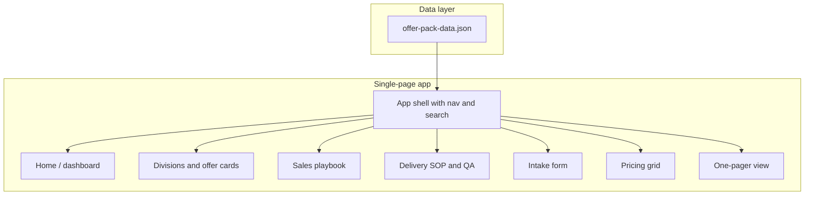

# Offer Pack Training & Reference Frontend

## Goal

One internal web app that:

- **Training:** Onboards new hires with the full offer set, sales playbook, and delivery flow.
- **Reference:** Lets sales and coders find any offer, pricing tier, objection handler, or QA checklist in seconds.
- **Consistent:** Single source of truth so everyone uses the same language and scope.
- **Adjustable on the fly:** Content driven by data (JSON); edits = change data and refresh (no code deploy).

---

## Content to Encompass (from [aerovista_offer_pack](aerovista_offer_pack))

| Source                                                                     | Content                                                                                         |
| -------------------------------------------------------------------------- | ----------------------------------------------------------------------------------------------- |
| [offer-pack.md](aerovista_offer_pack/offer-pack.md)                        | 7 divisions, ~24 offers (includes, turnaround, client provides, upsells), fulfillment rules     |
| [one-pager.md](aerovista_offer_pack/one-pager.md)                          | Client-ready offer menu + popular bundles + standard terms                                      |
| [pricing-grid.md](aerovista_offer_pack/pricing-grid.md)                    | Good / Better / Best per offer + bundle anchors                                                 |
| [sales-playbook.md](aerovista_offer_pack/sales/sales-playbook.md)          | 30-sec pitch, 5 qualification questions, objection handlers, close pattern, follow-up templates |
| [fulfillment-sop.md](aerovista_offer_pack/delivery/fulfillment-sop.md)     | Phases, revision policy, handoff                                                                |
| [qa-checklists.md](aerovista_offer_pack/delivery/qa-checklists.md)         | Web, Audio, Design, Drone checklists                                                            |
| [client-intake-form.md](aerovista_offer_pack/intake/client-intake-form.md) | Full intake fields                                                                              |
| [bundles.md](aerovista_offer_pack/bundles/bundles.md)                      | 3 bundles with includes + outcome                                                               |
| [divisions/*/.md](aerovista_offer_pack/divisions/)                         | 24 detailed offer cards (outcome, includes, client provides, exclusions, upsells)               |

All of the above must be reachable and scannable inside the app.

---

## Architecture

- **Data:** One (or a few) JSON file(s) under `aerovista_offer_pack/app/data/` (e.g. `offer-pack-data.json`). Structure: divisions (id, name, offers[]), each offer (id, name, outcome, includes, clientProvides, exclusions, upsells, turnaround, pricingTiers), bundles, sales (pitch, qualification, objections, close, followUp), delivery (phases, revisionPolicy, handoff, qaChecklists), intake (sections/fields), onePager (blurb, terms). This keeps the app 100% data-driven and “adjust on the fly” = edit JSON (or regenerate from .md) and refresh.
- **App:** Static HTML + CSS + JS only (no framework), same pattern as [template/index.html](template/index.html). Deployable to any static host or opened via `file://` if data is inlined or loaded from same directory. For `fetch()` of JSON, use a local server (e.g. `python -m http.server`) or deploy to GitHub Pages.
- **Location:** New folder `aerovista_offer_pack/app/` with `index.html`, `styles.css`, `app.js`, `data/offer-pack-data.json`. Optional: small script in repo to build `offer-pack-data.json` from the existing .md files so markdown stays source of truth and “adjust on the fly” can mean “edit .md, run script, refresh.”

---

## UX and Layout (quick to comprehend)

1. **Shell**
  - Sticky top bar: logo/title “AeroVista Offer Pack”, primary nav (Divisions | Sales | Delivery | Intake | Pricing | Bundles | One-pager).
  - Global search (or command palette Ctrl+K): type to filter and jump to any division or offer by name. Results: “NeXuS → LaunchPad”, “Sales → Objection: Too expensive”, etc.
  - Optional: role shortcuts on home (“I’m in sales” → Playbook + One-pager; “I’m delivery” → SOP + QA; “I’m coding” → Offer cards + exclusions).
2. **Home / dashboard**
  - 30-second pitch prominently.
  - Short “What’s in this app” (Divisions & offers, Sales playbook, Delivery, Intake, Pricing, One-pager).
  - Big tiles or list linking to Divisions, Sales, Delivery, Intake, Pricing, Bundles, One-pager so nothing is more than two clicks away.
3. **Divisions**
  - List of 7 divisions (NeXuS, SkyForge, EchoVerse, Summit, Lumina, Vespera, Horizon). Each expands or links to a division view.
  - Division view: division name, short tagline, list of offers. Each offer is a card; click to open full **offer card** (outcome, includes, client provides, exclusions, upsells, turnaround) — i.e. full content from `divisions/*/*.md`.
  - Ensure every offer from offer-pack and every division .md is represented and openable.
4. **Sales**
  - Sections: 30-sec pitch, Qualification (5 questions), Objection handlers, Close pattern, Follow-up templates. Each as a clear card or accordion. Copy-to-clipboard on each block for use during calls.
5. **Delivery**
  - Fulfillment SOP (phases, revision policy, handoff) in one block.
  - QA checklists: Web, Audio, Design, Drone as tabs or accordions. Checklist items as tickable or plain list.
6. **Intake**
  - Render intake form from data (sections and fields from client-intake-form). Display as reference; optional “Copy form text” or link to a shared doc.
7. **Pricing**
  - Per division: offer name with Good / Better / Best (and optional short labels from pricing-grid). Table or expandable rows. Bundle anchors at bottom.
8. **Bundles**
  - Three bundles: name, includes, outcome (from bundles.md). Optional link to related offers.
9. **One-pager**
  - Client-ready one-pager view (from one-pager content): divisions + offer bullets + popular bundles + standard terms. Print-friendly CSS so it can be printed or saved as PDF for sharing.
10. **Flexibility / “adjust on the fly”**
  - All copy and structure comes from `data/offer-pack-data.json`. To change wording, add an offer, or update pricing tiers, edit the JSON (or the .md and regenerate JSON) and refresh. No HTML/JS changes required for content. Optional later: simple “Edit” mode that writes back to JSON (e.g. via local file or backend) for power users.

---

## Visual and Technical Direction

- **Theming:** Professional, high-contrast, readable. Reuse patterns from [template/index.html](template/index.html) (e.g. CSS variables, card/panel, radius) so it feels consistent with ByteCast; consider a light-mode default for long reading and a dark mode toggle. Avoid clutter; whitespace and clear typography so new hires and experienced users both scan quickly.
- **Tech:** Vanilla JS, no build step. Load `offer-pack-data.json` with `fetch()` on init; render sections with small helper functions or minimal templating (e.g. createElement or a single lightweight pattern). Hash routing (e.g. `#divisions`, `#sales`, `#nexus-launchpad`) for deep links and back/forward. Optional: service worker for offline after first visit.
- **Accessibility:** Semantic HTML, skip link, focus-visible, aria where needed (e.g. expanded/collapsed), so sales and coders on keyboards and assistive tech can use it reliably.

---

## Data Build Strategy (keep it flexible)

- **Option A (recommended):** Add a small script (e.g. Node or Python) in `aerovista_offer_pack/` that reads all existing .md files (offer-pack, one-pager, pricing-grid, sales, delivery, intake, bundles, divisions/*/*.md), parses structure (headings, lists, key phrases), and outputs `app/data/offer-pack-data.json`. Run the script when markdown changes; app always loads JSON. “Adjust on the fly” = edit .md, run script, refresh.
- **Option B:** Hand-maintain JSON only; treat .md as legacy or export. “Adjust on the fly” = edit JSON and refresh.
- **Option C:** App fetches .md files and uses a client-side markdown parser. Simpler data pipeline but requires serving .md (e.g. same origin on GitHub Pages). “Adjust on the fly” = edit .md and refresh.

Recommendation: **Option A** so the existing markdown remains the source of truth, and the app stays fast and simple (no markdown parsing in the browser).

---

## File and Deliverable Summary

| Item                                                               | Purpose                                                                                      |
| ------------------------------------------------------------------ | -------------------------------------------------------------------------------------------- |
| `aerovista_offer_pack/app/index.html`                              | Single page shell, nav, and containers for all sections                                      |
| `aerovista_offer_pack/app/styles.css`                              | Layout, typography, themes, print styles for one-pager                                       |
| `aerovista_offer_pack/app/app.js`                                  | Load data, render sections, search/filter, hash routing, copy-to-clipboard                   |
| `aerovista_offer_pack/app/data/offer-pack-data.json`               | All content (divisions, offers, bundles, sales, delivery, intake, pricing, one-pager)        |
| `aerovista_offer_pack/scripts/build-offer-pack-data.js` (or `.py`) | One-time or on-demand: read .md, output offer-pack-data.json                                 |
| `aerovista_offer_pack/app/README.md`                               | How to run locally, how to edit content (edit .md + run script, or edit JSON), how to deploy |

---

## Implementation Order

1. **Data model and build script** — Define JSON schema and implement script that produces `offer-pack-data.json` from current .md (offer-pack, one-pager, pricing, sales, delivery, intake, bundles, all division .md). Validate that no offer or section is missing.
2. **Shell and home** — HTML structure, nav, home dashboard with pitch and links to every area. Load and parse JSON; no empty sections yet.
3. **Divisions and offer cards** — Render 7 divisions and all offers from data; offer detail view with outcome, includes, client provides, exclusions, upsells, turnaround. Deep link to `#division-offerId`.
4. **Sales and delivery** — Sales playbook and delivery SOP + QA checklists from data. Copy buttons where useful.
5. **Intake, pricing, bundles** — Intake form view, pricing grid (Good/Better/Best), bundles with includes + outcome.
6. **One-pager and print** — Dedicated one-pager view + print CSS.
7. **Search / command palette** — Global filter/jump (e.g. Ctrl+K) over divisions, offers, and key sections (objections, QA, etc.).
8. **Polish** — Theme toggle (light/dark), accessibility pass, README, and optional service worker for offline.

---

## Out of scope

- Backend or auth (internal reference only).
- Editing the data from inside the app (optional future enhancement).
- Replacing the existing .md files; they remain the source of truth with Option A.

