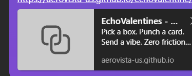
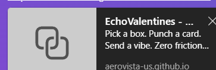
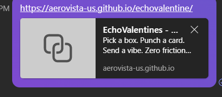

# MASTER FIX PLAN

Owner: Timbr
Date Created: 2026-02-12
Status: In Progress

This is the single execution path for stabilizing environment, repos, backend runtime, Square operations, ByteCast navigation, parser quality, and analytics CSP.

## Execution Order

- [ ] 1. Fix share mapping + stop running npm from UNC
- [ ] 2. Clean git status and push (Valentines + related repos)
- [ ] 3. Confirm storefront backend runs on Gunicorn
- [ ] 4. Separate Square sandbox vs production credentials
- [ ] 5. Run Square catalog cleanup pipeline + test import
- [ ] 6. ByteCast nav config + public/internal gating
- [ ] 7. Parser dedupe/clustering fix + regression run
- [ ] 8. Umami CSP whitelist finalize

---

## Phase 0 - Stop the Bleeding (30 min)

### 0.1 Secrets and Repo Hygiene

- [ ] Verify `.gitignore` includes: `.env`, `*.swp`, `*.pem`, `*.key`, `*.p12`, `node_modules`, `dist`, `build`
- [ ] Verify `.dockerignore` excludes: `.git`, `.env`, `node_modules`, local caches
- [ ] If secrets were ever committed, rotate all exposed credentials
- [ ] Add quick leak-scan command to repo docs/CI

Commands:

```powershell
rg -n "(SQ|Bearer|apikey|api_key|secret|token)" -g "!node_modules/**" -g "!.git/**"
```

Acceptance:

- [ ] No live secrets in tracked files
- [ ] Rotations complete and documented

---

## Phase 1 - Windows Share + npm Stability (1-2 hr)

### 1.1 Credential Collision (System error 1219)

- [ ] Remove conflicting mapped sessions
- [ ] Reconnect with one identity and one hostname (`\\nxcore` OR `\\100.115.9.61`)
- [ ] Do not mix hostnames in same login session

Commands:

```powershell
net use
net use * /delete /y
net use \\100.115.9.61\Collab /user:YOUR_USER
```

### 1.2 Stop npm on UNC paths

- [ ] Move active dev repos to local disk (`C:\dev\...`)
- [ ] Run Node/npm only on local path
- [ ] Keep SMB share as sync target only

Acceptance:

- [ ] `npm install` and `npm test` run from local path without UNC errors

---

## Phase 2 - Git State + Push (45 min)

### 2.1 Valentines Repo Commit/Push

- [ ] Commit staged changes with correct command
- [ ] Push branch

Commands:

```bash
git status
git add -A
git commit -m "fix: <summary>"
git push
```

### 2.2 Standard Repo Boot Template

- [ ] Default branch is `main`
- [ ] Pages strategy chosen (`root` or `/docs`)
- [ ] Baseline files present: `README.md`, `.gitignore`, `.gitattributes`
- [ ] One deployment path selected (GitHub Pages or Firebase unless intentionally both)

Acceptance:

- [ ] New repo boots and deploys without manual patchwork

---

## Phase 3 - Storefront Backend Prod Correctness (2-4 hr)

### 3.1 Gunicorn Runtime Validation

- [ ] Dockerfile uses Gunicorn in final CMD
- [ ] Compose points to correct image/context
- [ ] Logs show Gunicorn worker startup (not Flask dev server)

### 3.2 Env Discipline

- [ ] `.env.example` in repo
- [ ] Real `.env` excluded from repo
- [ ] Compose env loading verified
- [ ] `FLASK_DEBUG=0` and production mode set

### 3.3 One-Button Health Check

- [ ] Add script to build, run, hit `/api/health`, print pass/fail, dump logs on fail

Example (PowerShell):

```powershell
docker compose down --remove-orphans
docker compose build
docker compose up -d
Start-Sleep -Seconds 8
try {
  $r = Invoke-WebRequest -Uri "http://localhost:8000/api/health" -UseBasicParsing
  if ($r.StatusCode -eq 200) { "PASS" } else { "FAIL" }
} catch {
  "FAIL"
  docker compose logs --tail=200
  throw
}
```

Acceptance:

- [ ] Health endpoint returns 200 consistently
- [ ] Failure path includes actionable logs

---

## Phase 4 - Square Credentials Clarity (1-2 hr)

### 4.1 Hard Separation: Sandbox vs Production

- [ ] Maintain separate tokens/location IDs per environment
- [ ] Use explicit env vars:
  - `SQUARE_ENV=sandbox|production`
  - `SQUARE_ACCESS_TOKEN=...`
  - `SQUARE_LOCATION_ID=...`
- [ ] Never reuse sandbox token in production deployment

### 4.2 Square Config Checklist Doc

- [ ] Create `docs/SQUARE_CONFIG_CHECKLIST.md` with:
  - dashboard key locations
  - required copied values
  - `.env` mapping
  - verification request

Acceptance:

- [ ] Operator can set Square config in one pass with no guesswork

---

## Phase 5 - Square Catalog Cleanup for Web Store Import (3-6 hr)

### 5.1 Define Import Target Rules

- [ ] Include only web-store items
- [ ] Category/variation/SKU/image/description standards set
- [ ] Visibility flags validated

### 5.2 Cleaning Pipeline

- [ ] Normalize titles and option names
- [ ] Remove duplicates
- [ ] Ensure primary variation exists for each item
- [ ] Validate tax/shipping fields
- [ ] Validate required Square template columns

### 5.3 Pilot Import

- [ ] Import 5-10 items first
- [ ] Validate storefront render exactly
- [ ] Run full import only after pilot pass

Acceptance:

- [ ] No broken or duplicate catalog entries post-import

---

## Phase 6 - ByteCast Nav + Page Exposure Control (2-4 hr)

### 6.1 Public vs Internal Policy

- [ ] Define allowed public routes
- [ ] Mark internal-only routes explicitly

### 6.2 Config-Driven Navigation

- [ ] Create canonical nav config (example: `data/nav.json`)
- [ ] Render nav from config across pages
- [ ] Remove scattered hardcoded nav links

### 6.3 Route Audit

- [ ] Add route audit report/page listing:
  - detected HTML files
  - public/internal classification
  - nav-linked or not
  - recommended action (hide/move/delete)

Acceptance:

- [ ] Only intended pages are exposed to users

---

## Phase 7 - Parser 1400 Projects Fix (3-6 hr)

### 7.1 Clustering Rule Repair

- [ ] Stop splitting on weak boundaries (every header/chunk)
- [ ] Normalize project names (case/punctuation)
- [ ] Prevent each conversation fragment from becoming a new project

### 7.2 Deterministic Project Identity

- [ ] `project_id = normalized_name + stable_hash`
- [ ] Use conversation ID as supporting evidence, not primary ID
- [ ] Merge by similarity + shared tags threshold

### 7.3 Regression Workflow

- [ ] Run 20-conversation sample first
- [ ] Manually inspect merge/split quality
- [ ] Run full dataset only after sample passes

Acceptance:

- [ ] Project count drops to realistic range with stable grouping

---

## Phase 8 - Umami Analytics CSP Fix (1-2 hr)

### 8.1 Tight Script Allowlist

- [ ] Whitelist only required analytics domains (Umami and optional Cloudflare Insights)
- [ ] Keep CSP strict; no broad wildcard policy

### 8.2 Browser Verification

- [ ] No CSP script-block errors in console
- [ ] No mixed-content warnings

Acceptance:

- [ ] Analytics works with least-privilege CSP

---

## End-State Checklist

- [ ] Stable local dev workflow (no UNC npm instability)
- [ ] Clean repos and no exposed secrets
- [ ] Storefront backend production-correct
- [ ] Square sandbox/production fully separated
- [ ] Web-store catalog import validated
- [ ] ByteCast navigation exposure controlled
- [ ] Parser outputs sane project counts
- [ ] Umami analytics running under tight CSP

## Progress Log

- 2026-02-12: Playbook initialized.
